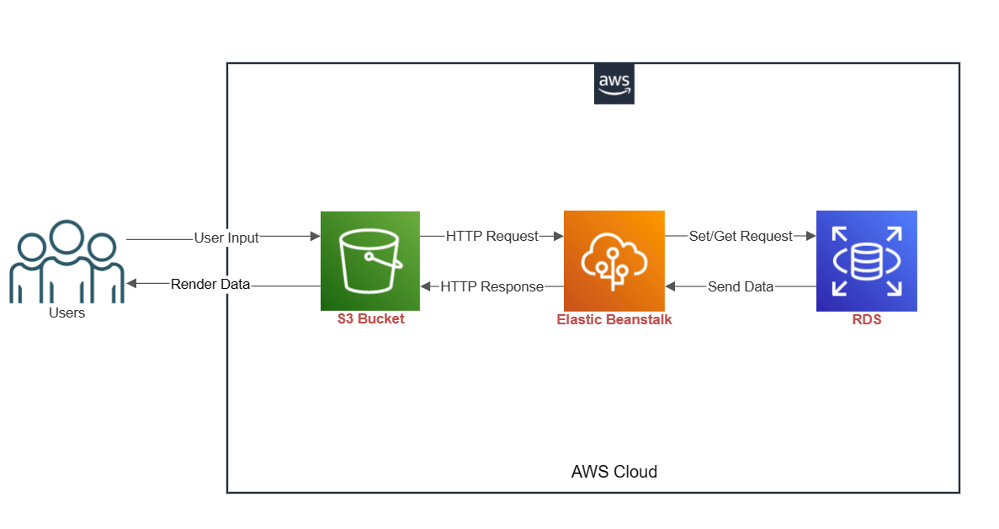
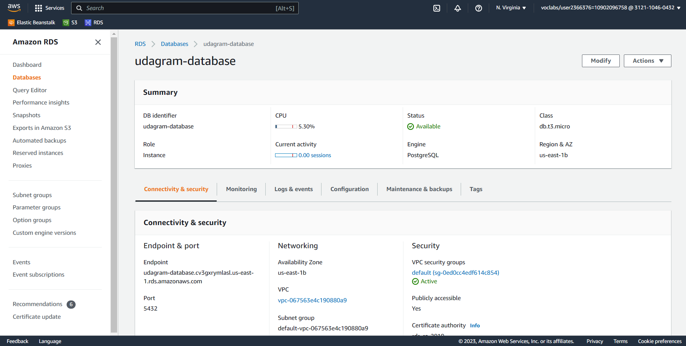
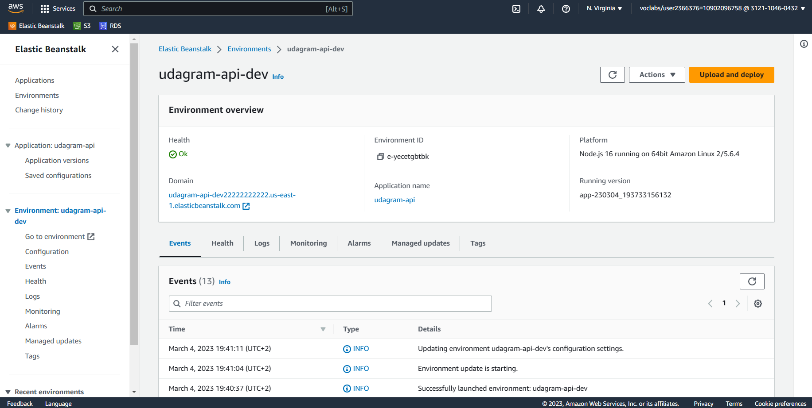
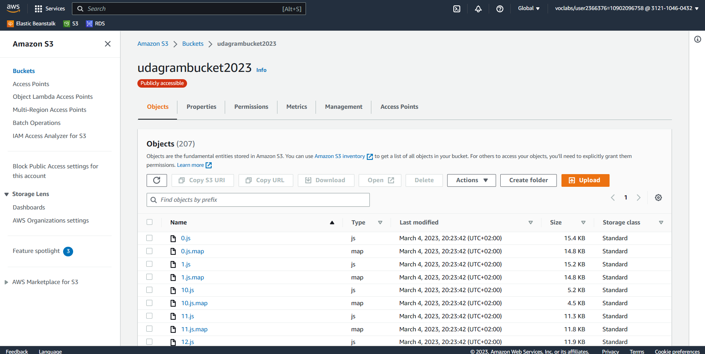
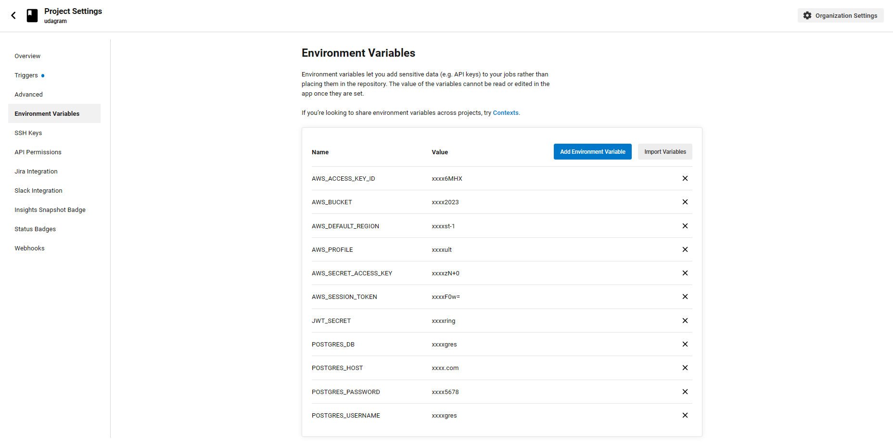
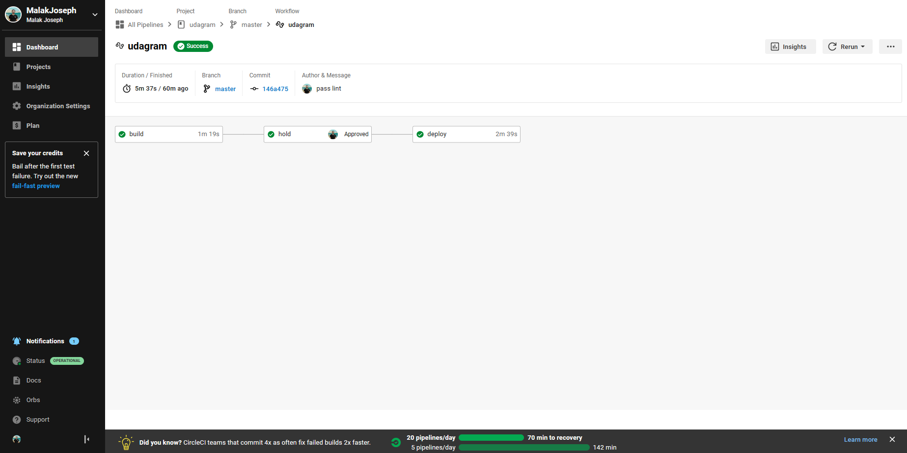
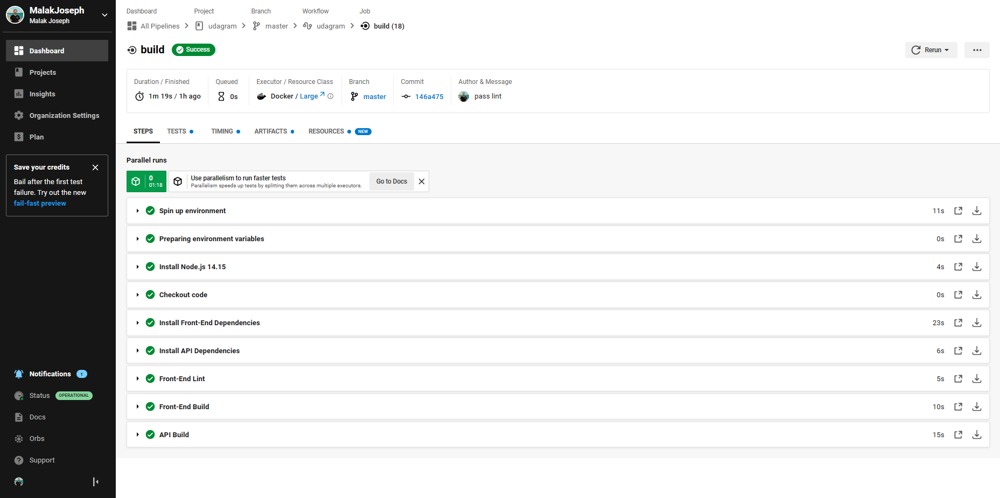
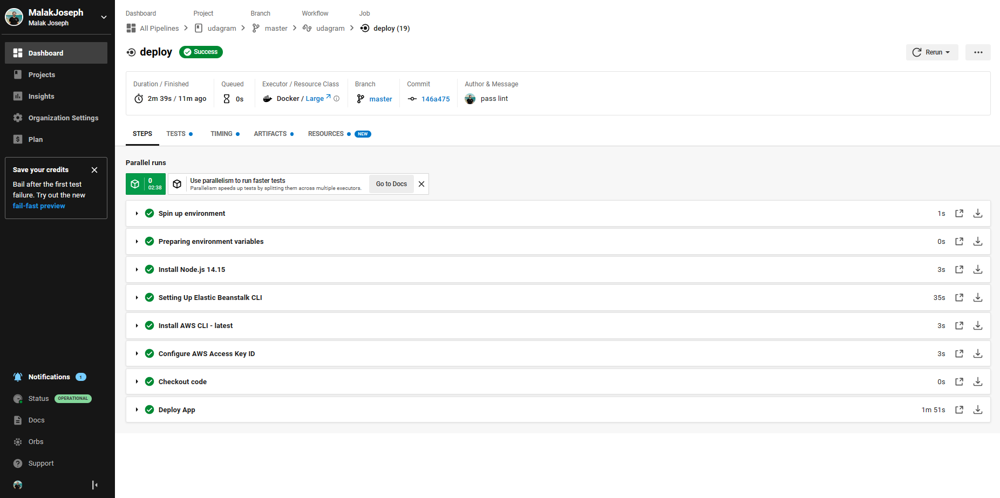

# Infrastructure description

- **Frontend** is hosted on Amazon S3
- **Backend** is hosted on Amazon Elastic Beanstalk
- **Postgres Database** is hosted on Amazon RDS

## Infrastructure Diagram

## Screenshots

### RDS

### Elastic Beanstalk

### S3

The production version should be accessible via this link
http://udagrambucket2023.s3-website-us-east-1.amazonaws.com

### CircleCI Pipeline

