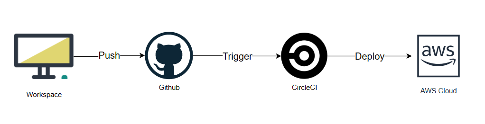

## Pipeline

1. Push code to Github triggers actions that runs on CircleCI to apply the CI/CD pipeline
2. CircleCI reads the jobs found on `.circleci/config.yml` and apply steps as follow:
   - Install node and checkout code
   - Install Front-End Dependencies
   - Install API Dependencies
   - Front-End Lint
   - Front-End Build
   - API Build
3. With a manual approval which applies the Continous Delivery strategy. CircleCI calls `Deploy App` (Install, build, deploy in both apps)
4. When all process/pipeline is sucessful, A new version of the app should be deployed using different AWS services.
